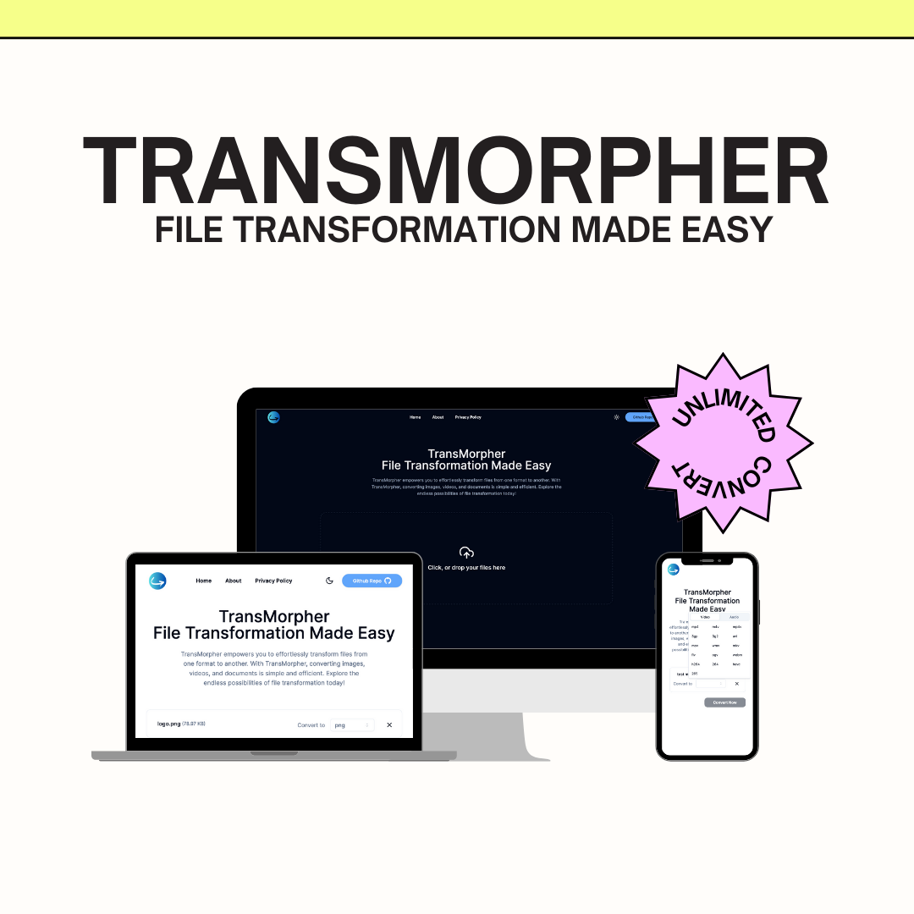

# TransMorpher



TransMorpher is a powerful web application built with Next.js, Tailwind CSS, Shadcn/ui, FFMPEG, and Web Assembly. It offers seamless multi-conversion capabilities for images, videos, and audio files simultaneously.

## Features

-   **Multi-Conversion**: Convert multiple files simultaneously, optimizing your workflow.
-   **Image Conversion**: Convert various image formats with ease.
-   **Video Conversion**: Transform video files into different formats.
-   **Audio Conversion**: Convert audio files into different formats.
-   **Flexible UI**: User-friendly interface powered by Tailwind CSS and Shadcn/ui for an intuitive user experience.
-   **Efficient Backend**: Leveraging FFMPEG and Web Assembly for robust and efficient file conversion.

## Installation

1.  Clone the repository:


```bash
git clone https://github.com/fatihes1/file-converter
```

2.  Navigate to the project directory:


```bash
cd file-converter
```

3.  Install dependencies:


```bash
npm install
```

4.  Start the development server:


```bash
npm run dev
```

5.  Open your browser and visit `http://localhost:3000` to view the application.

## Usage

1.  Upload files: Select the files you want to convert by clicking on the upload button.
2.  Choose conversion options: Select the desired format and settings for each file type.
3.  Start conversion: Initiate the conversion process and monitor the progress.
4.  Download converted files: Once the conversion is complete, download the transformed files to your local system.

## Technologies Used

-   **Next.js**: React framework for building server-side rendered web applications.
-   **Tailwind CSS**: Utility-first CSS framework for rapid UI development.
-   **Shadcn/ui**: UI components library for React applications.
-   **FFMPEG**: Cross-platform solution to record, convert, and stream audio and video.
-   **Web Assembly**: High-performance binary format for executing code in web browsers.

## Contributing

Contributions are welcome! Feel free to open an issue or submit a pull request with any improvements or features you'd like to add.

